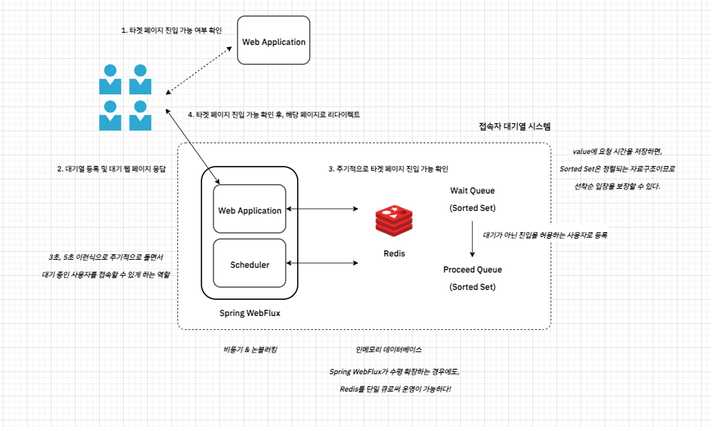

# 개요
이 프로젝트는 아이돌 티켓팅 접속자 대기열을 간소화한 버전입니다.
  
# 기술 스택
- 언어
    - Java 17
- 프레임워크 및 라이브러리
    - Spring Boot 3
    - Spring MVC
    - Spring WebFlux
    - JUnit 5
- Infra
    - Redis 6.2
    - Docker
  
# 전체 구조

  
# API
- web 모듈
  - 타겟 페이지 GET /home
  
- flow 모듈
  - 대기용 웹 페이지 GET /waiting-room
  - 사용자를 대기 큐에 등록 POST /api/v1/queue
  - 사용자를 입장 가능 상태로 전환 POST /api/v1/queue/allow
  - 사용자가 입장 가능한 상태인지 조회 GET /api/v1/queue/allowed
  - 입장 대기 시 필요한 정보 내려주기 GET /api/v1/queue/progress
  - 토큰 생성 후 쿠키 저장 GET /api/v1/queue/touch
  
# 결과


  
# 기타
## Docker 관련
```bash
docker run -d -p 6379:6379 --name idol-redis redis:6.2
```